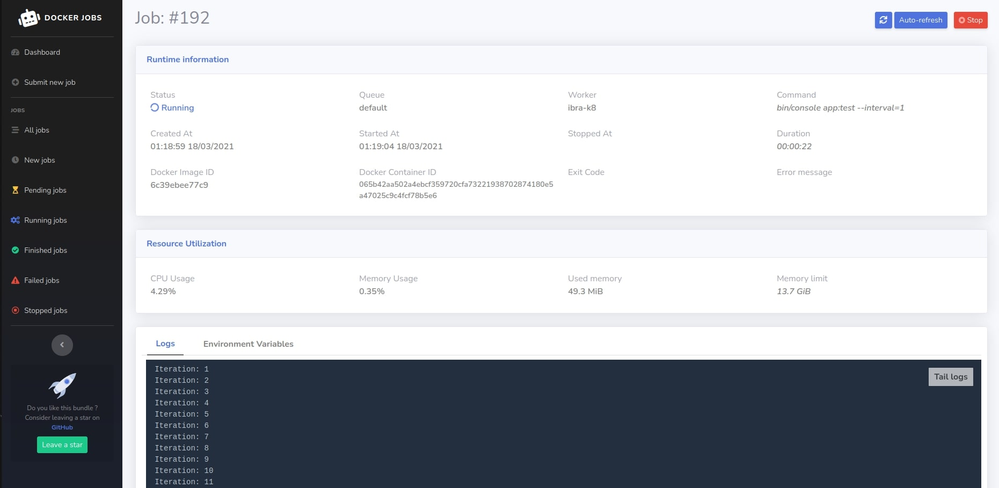
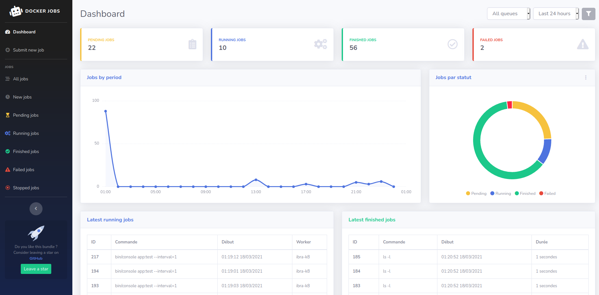

Monitoring Dashboard
====================

To manage and monitor jobs, there is a dashboard interface that you can activate.

* [Preview](#preview)
* [Configuration](#configuration)


### Preview
<div style="display: block;">
  <div style="margin-right: 20px">
    <h4>Job detail</h4>
    
  </div>

  <div>
    <h4>Dashboard</h4>
    
  </div>
</div>


Configuration
-------------
All you have to do is to import the bundle annotation routes:
```yaml
# routes.yaml - Symfony 4
# routing.yml - Symfony 2 - 3


polkovnik_docker_jobs:
  resource: '@DockerJobsBundle/Controller'
  type: annotation
# prefix: /admin ?

```

### Important note:
For the moment, there is no Authentication protecting these routes.  
If you want to protect them, you must do it yourself in `security.yaml` under `access_control:`.
